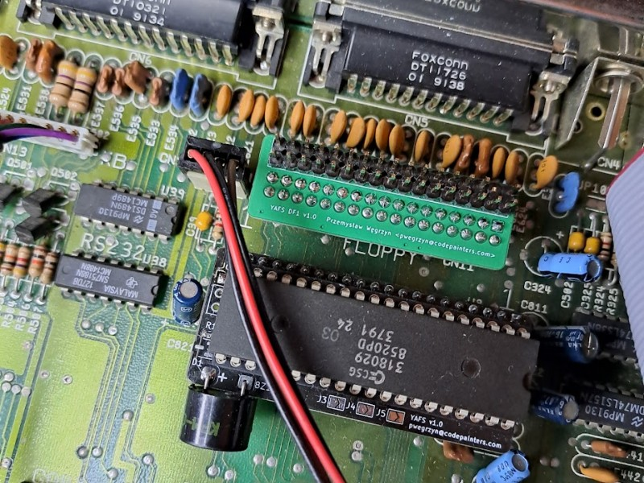
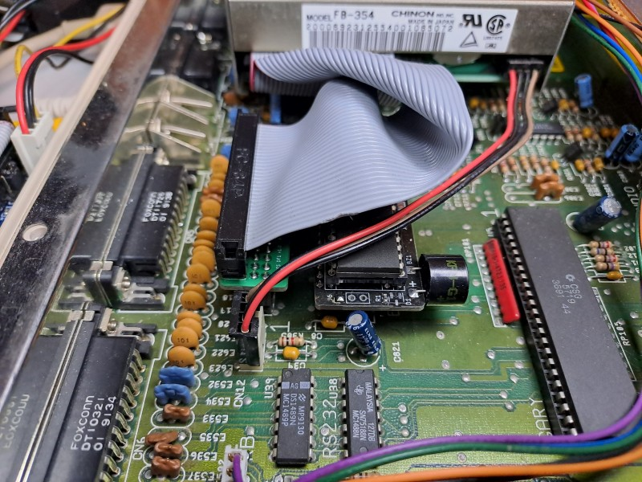

# Yet Another FDD Swapper for Amiga 500

This is my project of Amiga FDD swapper, based on `ATtiny 404` MCU. 

## What it does?

It allows for swapping internal `DF0:` drive and `DF1:` external drive (by crossing `SEL0` and `SEL1` signals from `MOS 8520 EVEN CIA`). Holding `Ctrl - Amiga - Amiga` keys for at least 2 seconds switches between normal / swapped configurations. The last used configuration is automatically restored on power up (unless configured not to do so, see below). Switching is confirmed with 1 (for normal) or 2 (for swapped) beeps.

The project consists of 2 separate PCBs:

* a bigger one that goes under the `EVEN CIA` chip - responsible for `SEL0` / `SEL1` swapping.
* a smaller one that which goes between Amiga motherboard and floppy ribbon cable. This PCB allows for internal FDD to be detected as DF1 (it's optional).

This is how the boards look like assembled in my Amiga 500 Rev 6A.

## Why another one?

Well, there are many FDD swapper projects already, all of these mods basically swap `SEL0` and `SEL1` of the `Even CIA`, using anything from simple mechanical switch to `74LS153` multiplexer (or even `4066` CMOS analog switch) driven by `ATtiny` MCU. Please note, that swapping `SEL0/1` signals is not enough for internal drive to work as `DF1:`, additional circuitry is needed to drive `~RDY` signal during the drive enumeration at boot time.

Looking for a solution, I've found [Amiga Floppy Swap](https://github.com/retronicdesign/AmigaFloppySwap) project, which is almost exactly what I need. However, I decided to make it slightly simpler:

* my project uses only a single chip, `ATtiny 404` microcontroller, which costs below **0.50 EUR** (at least at the time of this writing),
* the smaller board (which allows for internal drive being enumerated as `DF1:`) doesn't need to be connected with the bigger board. Actually it contains only 2 MOSFETs and 2 resistors and doesn't need any extra connections, beside the floppy flat cable (not even +5V supply!). 
* it is configurable - one can chose if it beeps on every start (or only when changing the configuration) and which configuration (last used vs always swapped vs always straight) it should use upon powering up (see [pcb_cia](pcb_cia) description for details).

Also, it's fun to make something new (even if reinventing the wheel).

## Project files

This repository contains 3 main directories (look there for more details, assembly instructions, etc.):

* [pcb_cia](pcb_cia) - KiCAD project of the bigger PCB which goes under the `CIA` chip.
* [pcb_df1](pcb_df1) - KiCAD project of the smaller PCB which goes between Amiga motherboard and the FDD ribbon cable. 

* [firmware](firmware) for the `ATtiny 404` MCU on the `pcb_cia` board (including programming instructions).

