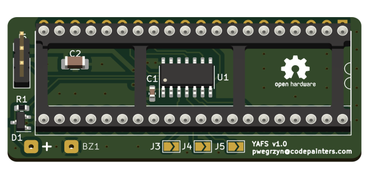

# CIA board

* [schematics in PDF format](pcb_cia.pdf)
* [Gerbers and Excellon](production/pcb_cia.zip)
* [BOM](production/bom.csv)

 

Note:

* for `BZ1` buzzer I have used magnetic buzzer, but pretty much anything should work, as long as  U1 maximum current (20 mA) is not exceeded. You may need to adjust R1 value.
* I've added `D1` diode as a back EMF protection, but it turned out it is not really necessary with the buzzer I use. 
* for programming instructions, see [here](../firmware)

## Configuration

The J3, J4 and J5 solder bridge jumpers can be used to configure the device:

* if `J3` is open, the buzzer beeps only to confirm the mode changing, if `J3` is closed the buzzer beeps (once or twice) at each power-up, to remind what mode is currently selected.
* if `J4` is open, last used mode is restored on power-up. If it is closed, the same mode is selected at each power-up - swapped (if `J5` is open) or normal (if `J5` is closed). If `J4` is open, `J5` state is ignored.
